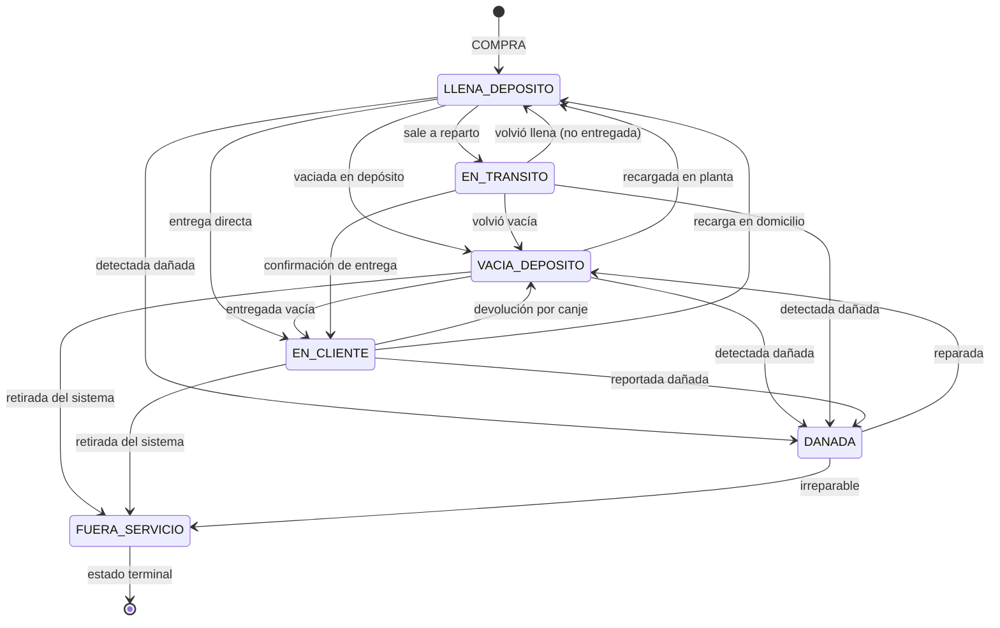

# Reglas de negocio del módulo Garrafas

Documento de referencia operativa del módulo de tracking individual de garrafas en
el sistema **ExtraGas**. Cubre estados, transiciones válidas, validaciones,
integraciones con Pedidos y Recepciones, y el flujo de vida completo de una
garrafa física.

> **Audiencia:** desarrolladores que tocan el módulo Garrafas, operadores que
> necesitan entender por qué la UI rechaza un cambio de estado, y mantenedores
> futuros que evalúan cambios en el modelo.
>
> **Documentos relacionados:**
>
> - `db/docs/DECISIONES.md` — decisiones de diseño globales (este módulo es la
>   concreción de las decisiones #1, #2, #10 y #16).
> - `db/docs/ERD.mmd` — diagrama entidad-relación donde se ven las FKs.

---

## 1. Propósito y alcance

ExtraGas vende garrafas de gas que son **activos físicos retornables**: el
cliente las devuelve vacías y se lleva llenas en la misma operación (canje). El
sistema necesita responder con certeza tres preguntas de negocio:

1. **¿Cuántas garrafas tengo en el depósito y en qué estado?** (stock disponible)
2. **¿Qué garrafas tiene cada cliente?** (gestión de canje y cuenta corriente)
3. **¿Cuál es el ciclo de vida de cada garrafa física?** (trazabilidad,
   auditoría, bajas por daño)

La unidad contable mínima es la **garrafa física individual**, identificada por
su `codigo` (troquel/serial). **No** se modela stock como un contador
desnormalizado: el stock se calcula agregando `COUNT(*) FROM garrafas` agrupado
por estado y capacidad (ver DECISIONES #1).

---

## 2. Modelo de datos

### 2.1 Tablas propias del módulo

| Tabla | Propósito | Soft delete |
|---|---|---|
| `garrafas` | Una fila por garrafa física. Estado actual + auditoría + observaciones. | Sí (`deleted_at`) |
| `movimientos_garrafa` | Log **append-only** de cada cambio de estado. Inmutable. | No (es histórico) |

### 2.2 Catálogos que referencian

| Catálogo | Filas clave (códigos) |
|---|---|
| `estados_garrafa` | `LLENA_DEPOSITO`, `VACIA_DEPOSITO`, `EN_CLIENTE`, `EN_TRANSITO`, `DAÑADA`, `FUERA_SERVICIO` |
| `tipos_movimiento_garrafa` | `COMPRA`, `ENTREGA_CLIENTE`, `DEVOLUCION_CLIENTE`, `ENVIO_PROVEEDOR`, `BAJA`, `REPARACION`, `REINGRESO`, `DAÑO`, `CAMBIO_ESTADO` |
| `productos` | Solo `maneja_garrafa_individual = TRUE` (GAS-10, GAS-15, GAS-45) genera filas en `garrafas` |
| `clientes`, `proveedores`, `recepciones_proveedor` | FKs opcionales según el estado y el origen de la garrafa |
| `usuarios` | Auditoría: `created_by`, `updated_by` |

### 2.3 Vistas read-only que consume el módulo

- `v_stock_garrafas` — stock agrupado por capacidad y estado (usada por
  `GarrafasController.Stock`).
- `v_garrafas_en_clientes` — garrafas en poder de clientes con `dias_en_cliente`
  (usada por `GarrafasController.EnClientes`).

Ambas excluyen soft-deleted.

---

## 3. Estados posibles y su significado

Definidos en `estados_garrafa`. Cada fila carga:

- `codigo` (clave única, se usa en C# como constante — ver
  `Constants/GarrafaEstados.cs`).
- `nombre` y `descripcion` legibles para UI.
- `es_disponible_para_venta` (bool) — la garrafa cuenta como stock vendible.
- `requiere_cliente` (bool) — si está en este estado, `cliente_id` es
  obligatorio. Sólo `EN_CLIENTE` lo tiene en `TRUE`.
- `color` (HEX) — para badges en la UI.

| Código | Nombre | `es_disponible_para_venta` | `requiere_cliente` | Color | Significado de negocio |
|---|---|---|---|---|---|
| `LLENA_DEPOSITO` | Llena en depósito | TRUE | FALSE | `#228B22` (verde) | Garrafa llena lista para entregar. **Es el stock vendible.** |
| `VACIA_DEPOSITO` | Vacía en depósito | FALSE | FALSE | `#808080` (gris) | Garrafa vacía que espera recarga o devolución al proveedor. |
| `EN_TRANSITO` | En tránsito | FALSE | FALSE | `#FFA500` (naranja) | Garrafa en reparto; aún no se confirmó la entrega. |
| `EN_CLIENTE` | En cliente | FALSE | **TRUE** | `#1E90FF` (azul) | Garrafa en poder de un cliente (canje o consignación). El `cliente_id` es **obligatorio**. |
| `DAÑADA` | Dañada | FALSE | FALSE | `#DC143C` (rojo) | Garrafa dañada, fuera del flujo comercial. Se puede reparar (`→ VACIA_DEPOSITO`) o retirar (`→ FUERA_SERVICIO`). |
| `FUERA_SERVICIO` | Fuera de servicio | FALSE | FALSE | `#2F2F2F` (gris oscuro) | **Estado terminal.** Garrafa retirada del sistema; nunca vuelve al inventario activo. |

### 3.1 Estados terminales

`FUERA_SERVICIO` es el único estado terminal: una vez allí, la garrafa no
puede transicionar a ningún otro estado. Esto refleja una decisión de
dominio: una garrafa retirada del sistema (robada, vendida como chatarra,
destruida) no puede reincorporarse mágicamente al inventario — si vuelve a
ingresar, es una **garrafa nueva** con un `codigo` distinto.

`EN_TRANSITO` **no** es terminal, pero es un estado intermedio que requiere
confirmación manual (la entrega se confirma con `→ LLENA_DEPOSITO` o `→
EN_CLIENTE`).

---

## 4. Tipos de movimiento

Definidos en `tipos_movimiento_garrafa`. Cada `movimientos_garrafa` referencia
uno y solo uno. Sirven para trazabilidad e informes (ej. "garrafas salidas por
DAÑO en el último mes").

| Código | Origen | Descripción |
|---|---|---|
| `COMPRA` | `RecepcionService` | Ingreso por recepción de proveedor. Crea la fila en `garrafas`. |
| `ENTREGA_CLIENTE` | `PedidoService` (canje) | Salida hacia un cliente. Setea `cliente_id` en la garrafa. |
| `DEVOLUCION_CLIENTE` | `PedidoService` (canje) | Regreso desde un cliente. Limpia `cliente_id` en la garrafa. |
| `ENVIO_PROVEEDOR` | Operación interna | Salida hacia proveedor (recarga, devolución de garantía). |
| `BAJA` | Operación interna | Baja definitiva. Lleva a `FUERA_SERVICIO`. |
| `REPARACION` | Operación interna | Envío a reparación. Lleva a `DAÑADA` si no estaba. |
| `REINGRESO` | Operación interna | Vuelta de reparación. Lleva a `VACIA_DEPOSITO`. |
| `DAÑO` | Operación interna | Registro de daño en operación. Lleva a `DAÑADA`. |
| `CAMBIO_ESTADO` | `GarrafaService.CambiarEstadoAsync` (manual desde UI) | Cambio de estado hecho a mano por un operador. **Es el único tipo que respeta la matriz de transiciones.** |

**Importante:** todos los tipos salvo `CAMBIO_ESTADO` son manejados por
servicios de otros módulos (`RecepcionService`, `PedidoService`) y **no
validan contra la matriz** — el servicio que los origina conoce el flujo de
negocio y se responsabiliza de la consistencia. La matriz sólo aplica al flujo
manual desde la UI (`GarrafasController.CambiarEstado`).

---

## 5. Diagrama de estados

Diagrama Mermaid de las transiciones válidas para el flujo `CAMBIO_ESTADO` (ver
sección 6 para la tabla completa).



---

## 6. Matriz de transiciones válidas (flujo manual)

Implementada en `src/ExtraGasMVC/Services/GarrafaTransiciones.cs`. Define qué
transiciones están permitidas cuando el cambio de estado se hace desde la UI
(`GarrafaService.CambiarEstadoAsync`). Las auto-transiciones (`X → X`) son
rechazadas como no-ops.

| Origen ↓ → Destino | `LLENA_DEPOSITO` | `VACIA_DEPOSITO` | `EN_TRANSITO` | `EN_CLIENTE` | `DAÑADA` | `FUERA_SERVICIO` |
|---|---|---|---|---|---|---|
| **`LLENA_DEPOSITO`** | — | ✓ | ✓ | ✓ | ✓ | — |
| **`VACIA_DEPOSITO`** | ✓ | — | — | ✓ | ✓ | ✓ |
| **`EN_TRANSITO`** | ✓ | ✓ | — | ✓ | ✓ | — |
| **`EN_CLIENTE`** | ✓ | ✓ | — | — | ✓ | ✓ |
| **`DAÑADA`** | — | ✓ | — | — | — | ✓ |
| **`FUERA_SERVICIO`** | — | — | — | — | — | — |

### 6.1 Por qué la matriz está en C# y no en BD

Es lógica de negocio invariante, no un catálogo administrativo. La justificación
completa está en DECISIONES #16. Resumen:

- Describe restricciones del dominio físico (una garrafa dañada no se entrega).
- Viaja con el código del servicio: cualquier cambio se revisa en PR.
- El compilador detecta referencias inválidas.
- Es trivialmente testeable sin fixtures de BD.

### 6.2 Por qué los flujos de negocio no consultan la matriz

`RecepcionService` (compra) y `PedidoService` (canje) registran movimientos
directamente con su `tipo_movimiento` específico. La matriz está pensada para
el caso **manual**, donde un operador humano puede equivocarse de estado. En
los flujos automatizados el servicio que origina el cambio conoce la
secuencia correcta y se asume la responsabilidad.

---

## 7. Validaciones de negocio

Resumen de todas las invariantes que el módulo garantiza, agrupadas por capa.

### 7.1 Esquema (CHECK + UNIQUE + FK)

- **`capacidad_kg IN (10, 15, 45)`** — `CHECK` constraint. No se admiten
  capacidades distintas.
- **`codigo` UNIQUE** — `uq_garrafas_codigo`. La unicidad se chequea tanto a
  nivel SQL como en `GarrafaService.CreateAsync` (mensaje amigable). En
  `UpdateAsync` se excluye la propia fila.
- **FKs restrict**: `proveedor_id`, `recepcion_id`, `estado_garrafa_id`,
  `cliente_id`, `created_by`, `updated_by` usan `ON DELETE RESTRICT`. No se
  puede borrar un proveedor/cliente/estado que tenga garrafas activas.

### 7.2 Trigger `trg_garrafas_bi_validate`

Sólo se dispara en `INSERT`. Si el estado destino tiene `requiere_cliente =
TRUE` (caso actual: `EN_CLIENTE`), exige `cliente_id NOT NULL`; si no, dispara
`SIGNAL SQLSTATE '45000'`.

**Gap conocido:** este trigger **no cubre** las mutaciones por `UPDATE` ni
los cambios de estado vía `CAMBIO_ESTADO`. La validación para esos flujos la
hace la app en `GarrafaService.CambiarEstadoAsync` (chequea
`destino.RequiereCliente && !dto.ClienteId.HasValue`).

### 7.3 Trigger `trg_mov_garrafa_ai`

Dispara `AFTER INSERT ON movimientos_garrafa`. Actualiza:

- `garrafas.estado_garrafa_id = NEW.estado_destino_id`
- `garrafas.fecha_ultimo_movimiento = NEW.fecha`

**Fuente única de verdad:** la app **no** escribe estas columnas en
`garrafas` al hacer cambios de estado. El estado y la fecha de último
movimiento los mantiene el trigger desde la fila de `movimientos_garrafa`. La
app sólo actualiza `garrafas.cliente_id`, `updated_at`, `updated_by` y
`observaciones` — ver `GarrafaService.CambiarEstadoAsync` y
`RegistrarMovimientoPorCanjeAsync`.

### 7.4 Validaciones de la capa de servicio (`GarrafaService`)

| Validación | Servicio / método | Excepción |
|---|---|---|
| Código único al crear/editar | `CreateAsync` / `UpdateAsync` | `InvalidOperationException` ("Ya existe una garrafa con el código X") |
| Capacidad ∈ {10,15,45} | DTO (`Range(10, 45)`) + CHECK en BD | `ModelState` o `DbUpdateException` |
| Transición válida según matriz | `CambiarEstadoAsync` / `RegistrarMovimientoPorCanjeAsync` | `InvalidOperationException` con mensaje que cita la matriz |
| Estado destino existe en catálogo | `CambiarEstadoAsync` | `InvalidOperationException` |
| Estado destino requiere cliente | `CambiarEstadoAsync` | `InvalidOperationException` ("El estado X requiere seleccionar un cliente") |
| Tipo de movimiento `CAMBIO_ESTADO` existe | `CambiarEstadoAsync` | `InvalidOperationException` |
| Auto-transición (`X → X`) | `GarrafaTransiciones.EsValida` | `InvalidOperationException` (rechazada) |
| No se elimina en `EN_CLIENTE` / `EN_TRANSITO` | `DeleteAsync` | `InvalidOperationException` ("No se puede eliminar una garrafa en estado X. Primero cambie su estado") |
| Garrafa en `FUERA_SERVICIO` no se edita (ni por POST hand-crafted) | `GarrafasController.Edit` (GET y POST) | Redirige a `Details` con `TempData["Error"]` |
| Estados terminales: dropdown deshabilitado en UI | `GetTransicionesDisponiblesAsync` | Devuelve enumerable vacío → UI muestra `alert-warning` |

### 7.5 Reglas de presentación en UI

- **Stock vendible:** sólo cuentan las garrafas con `es_disponible_para_venta =
  TRUE` en su estado actual (es decir, `LLENA_DEPOSITO`). Lo muestra
  `GarrafasController.Stock` (vista `v_stock_garrafas`).
- **Garrafas en cliente:** las que están en `EN_CLIENTE`. Vista
  `GarrafasController.EnClientes` (vista `v_garrafas_en_clientes`).
- **Paginación y filtros:** `Index` pagina y filtra en SQL (issue #52) por
  `codigo` (LIKE) y `capacidad` (igualdad). Orden por `codigo`, `capacidad`,
  `estado`, `cliente`, `fechacompra` o `ultimomov` (issue #53). Page size
  máximo 100.

---

## 8. Integraciones con otros módulos

### 8.1 Recepciones de proveedor → COMPRA

Cuando se confirma una `recepcion_proveedor` que incluye productos con
`maneja_garrafa_individual = TRUE`, `RecepcionService` (no `GarrafaService`)
hace, dentro de una transacción:

1. Crea los `recepcion_items`.
2. Para cada garrafa física comprada, crea una fila en `garrafas` con:
   - `estado_garrafa_id` = `LLENA_DEPOSITO` (o `VACIA_DEPOSITO` si el producto
     se compra vacío — depende del producto y de la operación).
   - `proveedor_id` y `recepcion_id` populados.
   - `fecha_compra` = fecha de la recepción.
3. Crea un `movimientos_garrafa` con `tipo_movimiento_id = COMPRA`,
   `estado_destino_id` igual al estado inicial, `recepcion_id` populated.

La matriz de transiciones no aplica aquí: la app sabe que `COMPRA` siempre
entra a `LLENA_DEPOSITO` (o `VACIA_DEPOSITO`).

### 8.2 Pedidos → ENTREGA_CLIENTE / DEVOLUCION_CLIENTE

Cuando se confirma la entrega de un pedido que tiene líneas de tipo
`ENTREGA` (llena) y/o `DEVOLUCION` (vacía) con productos
`maneja_garrafa_individual = TRUE`, `PedidoService.RegistrarCanjePedidoAsync`
abre una transacción y, **dentro de ella**, llama a
`GarrafaService.RegistrarMovimientoPorCanjeAsync` por cada garrafa física
involucrada:

- **ENTREGA**: la garrafa pasa a `EN_CLIENTE`, se setea `cliente_id =
  pedido.cliente_id`, `movimientos_garrafa.cliente_id` igual, `tipo_movimiento
  = ENTREGA_CLIENTE`.
- **DEVOLUCION**: la garrafa vuelve a `LLENA_DEPOSITO`, se limpia `cliente_id`
  (queda NULL), `tipo_movimiento = DEVOLUCION_CLIENTE`.

**Regla transaccional:** la app debe crear, en una sola transacción, los
`pedido_items` Y los `movimientos_garrafa` correspondientes a cada garrafa
física específica. Si la transacción aborta, no debe quedar ningún movimiento
huérfano (DECISIONES #2).

### 8.3 Clientes → EN_CLIENTE

Una garrafa en `EN_CLIENTE` siempre tiene `cliente_id` populated. Esto se
usa para:

- Mostrar "garrafas que tiene el cliente" en su ficha.
- Calcular cuenta corriente implícita (cuántas garrafas tiene vs. cuántas
  declaró haber devuelto).
- Validación al hacer pedidos: el sistema puede sugerir canjes según el
  historial del cliente.

### 8.4 Reportes y stock

Las vistas `v_stock_garrafas` y `v_garrafas_en_clientes` se usan en el módulo
de Reportes para:

- Stock por capacidad y estado.
- Antigüedad de garrafas en poder del cliente (`dias_en_cliente`).
- Garrafas con mucho tiempo en `EN_TRANSITO` (alerta operativa).

---

## 9. Flujo completo del ciclo de vida

El camino "feliz" más largo para una garrafa. Los puntos de decisión están
marcados con `[…]`.

```
1. COMPRA a proveedor
   └─> RecepcionService crea fila en garrafas con estado LLENA_DEPOSITO
       └─> movimiento_garrafa (COMPRA → LLENA_DEPOSITO)

2. Sale a reparto
   └─> operador: UI CambiarEstado → EN_TRANSITO
       └─> movimiento_garrafa (CAMBIO_ESTADO: LLENA_DEPOSITO → EN_TRANSITO)

3. Se confirma la entrega
   └─> operador: UI CambiarEstado → EN_CLIENTE (con cliente seleccionado)
       └─> movimiento_garrafa (CAMBIO_ESTADO: EN_TRANSITO → EN_CLIENTE)

4. Cliente devuelve la vacía en un nuevo pedido (canje)
   └─> PedidoService.RegistrarCanjePedidoAsync llama a
       GarrafaService.RegistrarMovimientoPorCanjeAsync:
         - DEVOLUCION_CLIENTE: EN_CLIENTE → LLENA_DEPOSITO, limpia cliente_id
         - ENTREGA_CLIENTE:    LLENA_DEPOSITO → EN_CLIENTE, setea cliente_id
   └─> movimientos_garrafa (DEVOLUCION_CLIENTE y/o ENTREGA_CLIENTE)

5. La vacía regresa a planta para recargar
   └─> operador: UI CambiarEstado → VACIA_DEPOSITO [opcional, normalmente
       el paso 4 ya la deja en LLENA_DEPOSITO si se recibió vacía y se
       entrega llena]

6. Recargada en planta
   └─> operador: UI CambiarEstado → LLENA_DEPOSITO
       └─> movimiento_garrafa (CAMBIO_ESTADO: VACIA_DEPOSITO → LLENA_DEPOSITO)

7. [DAÑO] Se detecta dañada en cualquier punto
   └─> operador: UI CambiarEstado → DANADA
       └─> movimiento_garrafa (CAMBIO_ESTADO: X → DANADA)
   └─> [alternativa] se repara → VACIA_DEPOSITO (DAÑADA → VACIA_DEPOSITO)
              o se da de baja → FUERA_SERVICIO (DAÑADA → FUERA_SERVICIO)

8. [BAJA] Se retira del sistema
   └─> operador: UI CambiarEstado → FUERA_SERVICIO
       └─> movimiento_garrafa (CAMBIO_ESTADO: X → FUERA_SERVICIO)
   └─> estado terminal — la fila queda para auditoría histórica pero no
       vuelve a participar del stock.
```

### 9.1 Caminos abreviados

- **Venta directa sin reparto:** `LLENA_DEPOSITO → EN_CLIENTE` (skip del
  paso 2-3). El operador registra el cambio manual con cliente seleccionado.
- **Garrafa vacía entregada:** `VACIA_DEPOSITO → EN_CLIENTE` (la garrafa ya
  estaba vacía; se entrega vacía).
- **Devolución al proveedor:** `LLENA_DEPOSITO → VACIA_DEPOSITO` (la
  operación la hace el operador manualmente o por flujo interno).

---

## 10. Auditoría

Toda fila en `garrafas` lleva:

- `created_at`, `created_by` (FK a `usuarios`).
- `updated_at`, `updated_by` (FK a `usuarios`).
- `deleted_at` (soft-delete).

Toda fila en `movimientos_garrafa` lleva:

- `created_at`, `created_by`.
- **No tiene** `updated_at`/`updated_by` ni `deleted_at` porque es append-only:
  un movimiento registrado no se modifica ni se borra. Esto preserva la
  trazabilidad del ciclo de vida.

`GarrafaService.CambiarEstadoAsync` resuelve el `empleado_id` a partir del
`currentUserId` (issue #43). Si el usuario no tiene empleado activo, el
movimiento queda con `empleado_id = NULL` pero igual registra `created_by`.

---

## 11. Reglas de UI

- **Listado (`Index`)**: paginado (20 por página, max 100), filtra por código
  y capacidad, ordena por 6 campos. Muestra badges de estado con el color del
  catálogo.
- **Detalles (`Details`)**: muestra garrafa + observaciones + historial
  resumido.
- **Historial (`Historial`)**: vista dedicada con todos los
  `movimientos_garrafa` de la garrafa, ordenados por fecha descendente.
- **Cambiar estado (`CambiarEstado`)**: dropdown poblado con
  `GetTransicionesDisponiblesAsync`. Si el estado actual es terminal
  (`FUERA_SERVICIO`), el enumerable viene vacío y la UI muestra
  `alert-warning` con el botón deshabilitado.
- **Crear (`Create`)**: dropdown de estado, capacidad 10/15/45, fecha de
  compra. Si se elige `EN_CLIENTE`, el formulario exige cliente.
- **Editar (`Edit`)**: bloqueado si la garrafa está en `FUERA_SERVICIO`
  (issue #41). El POST revalida contra el estado actual en BD (no contra el
  valor enviado por el form), para evitar hand-crafted requests.
- **Eliminar (`Delete`)**: soft-delete. Bloqueado si la garrafa está en
  `EN_CLIENTE` o `EN_TRANSITO` para preservar la trazabilidad del canje.
- **Stock (`Stock`)**: vista agregada por capacidad y estado.
- **En clientes (`EnClientes`)**: lista de garrafas en poder de clientes,
  con `dias_en_cliente`.

---

## 12. Gotchas y casos especiales

1. **Stock calculado, no almacenado.** No existe una columna
   `productos.stock_garrafas` ni similar. Cualquier reporte de stock hace
   `COUNT(*) GROUP BY estado_garrafa_id, capacidad_kg` (o lee
   `v_stock_garrafas`). Esto evita drift entre el contador y la realidad.

2. **El estado lo escribe el trigger, no la app.** Si modificás el estado de
   una garrafa directamente con SQL (`UPDATE garrafas SET estado_garrafa_id
   = ?`) sin insertar un `movimientos_garrafa`, vas a tener inconsistencia:
   el trigger `trg_mov_garrafa_ai` no se dispara y
   `fecha_ultimo_movimiento` queda desfasado. **Toda transición debe pasar
   por un INSERT en `movimientos_garrafa`.**

3. **`FUERA_SERVICIO` no vuelve.** Si por error una garrafa en
   `FUERA_SERVICIO` necesita reingresar (caso real: se vendió como chatarra
   y volvió al mes siguiente), la operación correcta es **crear una garrafa
   nueva** con código distinto. No se hace `FUERA_SERVICIO → LLENA_DEPOSITO`.

4. **`EN_TRANSITO` es temporal por diseño.** La UI no impide que una garrafa
   quede en `EN_TRANSITO` por días. Un reporte de "garrafas en tránsito
   hace más de X días" debería existir como alerta operativa (issue a
   evaluar).

5. **Borrar un cliente con garrafas en `EN_CLIENTE` rompe el invariante.**
   La FK `fk_garrafas_cliente` está en `RESTRICT`, así que el `DELETE`
   directo del cliente falla. La app debe primero mover las garrafas a
   `VACIA_DEPOSITO` o similar. Esto NO está automatizado hoy — ver
   consideraciones en DECISIONES #3.

6. **`requiere_cliente` se valida en INSERT (trigger) y en CAMBIO_ESTADO
   (app), pero no en UPDATE directo.** Si alguien hace `UPDATE garrafas SET
   estado_garrafa_id = (id de EN_CLIENTE), cliente_id = NULL` directamente
   en BD, el invariante se rompe. El código de aplicación siempre debe
   pasar por `GarrafaService.CambiarEstadoAsync`.

7. **El campo `observaciones` se puede editar.** Es texto libre y no forma
   parte de la máquina de estados. Útil para registrar por qué una garrafa
   se dio de baja, dónde se dañó, etc.

8. **El historial es append-only.** No hay UI para borrar ni editar
   movimientos. Si un movimiento se cargó mal, se debe cargar un movimiento
   correctivo (ej. `CAMBIO_ESTADO` revertiendo el cambio), nunca borrar el
   original.

---

## 13. Referencias cruzadas

- DECISIONES #1 — tracking individual por `codigo`.
- DECISIONES #2 — modelo de canje en `pedido_items` con tipos `ENTREGA` /
  `DEVOLUCION` / `VENTA`.
- DECISIONES #3 — soft-delete universal.
- DECISIONES #10 — recepciones de proveedor y garrafas (compra → `COMPRA`).
- DECISIONES #16 — máquina de estados hard-coded en C#, con la matriz.
- `src/ExtraGasMVC/Services/GarrafaTransiciones.cs` — implementación de la
  matriz.
- `src/ExtraGasMVC/Services/Implementations/GarrafaService.cs` — todos los
  métodos del módulo.
- `src/ExtraGasMVC/Constants/GarrafaEstados.cs` — constantes de los códigos
  de estado.
- `src/ExtraGasMVC/Controllers/GarrafasController.cs` — endpoints MVC.
- `db/migrations/20260102_000006_create_garrafas.sql` — esquema.
- `db/migrations/20260102_000007_create_triggers.sql` — triggers
  (`trg_mov_garrafa_ai`, `trg_garrafas_bi_validate`).
- `db/migrations/20260102_000009_seed_data.sql` — seed de
  `estados_garrafa` y `tipos_movimiento_garrafa`.
- `db/migrations/20260608_000001_add_tipo_movimiento_cambio_estado.sql` —
  seed del tipo `CAMBIO_ESTADO`.
