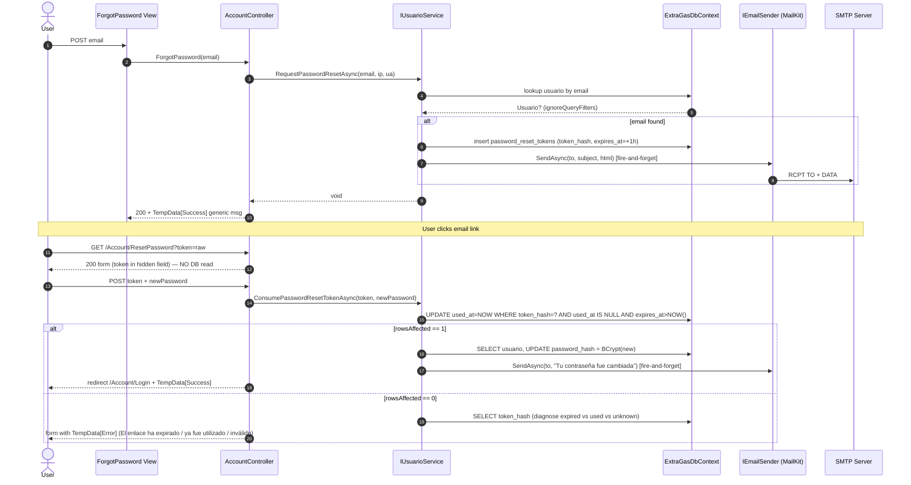

# Design: password-recovery

## Technical Approach

Self-service password reset using a dedicated `password_reset_tokens` table (no Identity, no DataProtection stateless tokens). Raw token (32 random bytes, base64url-encoded) is sent in the email only; SHA-256 hex hash is persisted. Consume is an atomic UPDATE guaranteeing single-use. Rate limiting uses in-process `IMemoryCache` per IP. SMTP via MailKit, configured by `IOptions<EmailOptions>`. Fits the existing custom-auth architecture (cookie auth + BCrypt + scoped services).

## Sequence



## Architecture Decisions

| Decision | Choice | Alternatives | Rationale |
|---|---|---|---|
| Token store | Dedicated `password_reset_tokens` table | Identity tokens; DataProtection stateless | Matches custom-auth architecture; full control over lifecycle; aligns with `AGENTS.md` soft-delete + audit conventions |
| Token format | 32 bytes CSPRNG → 43-char base64url | 64-hex random; UUID v4 | URL-safe, fixed-length, no padding (`=`), raw never persisted |
| Hash | `SHA256(rawBytes)` → 64 lowercase hex | bcrypt(high-cost); HMAC with server key | Spec requires SHA-256; deterministic for index equality; zero server-side secret risk |
| Single-use | Atomic `UPDATE … WHERE used_at IS NULL AND expires_at > NOW()`, rows-affected gate | Pessimistic `SELECT … FOR UPDATE`; tombstone column | InnoDB row-lock serializes concurrent attempts via `uk_token_hash`; rows-affected is the success signal |
| Rate limit | `IMemoryCache` counter `password-reset:forgot:{ip}`, TTL 1h, max 3 | Redis; `AspNetCoreRateLimit` | Single-instance homelab; per-process reset is acceptable trade-off (see Risk) |
| Email transport | MailKit `SmtpClient` behind `IEmailSender` interface | `System.Net.Mail.SmtpClient`; SendGrid SDK | MailKit is the de-facto .NET SMTP client; maintained; supports STARTTLS/SSL; interface enables test swap |
| Email timing | Fire-and-forget `Task.Run` with new DI scope | In-request await; hosted queue | Matches proposal ("SMTP failure swallowed"); SMTP 1-3s latency must not block HTTP 200 |
| Password policy | Reuse `IPasswordPolicyService` + `_passwordOptions` | Inline regex | Single source of truth; user gets the same rules as `ChangePassword` |
| DbContext retry | No `EnableRetryOnFailure` (current config) | Add retry on this change | Out of scope; existing services rely on current Pomelo config; risk of silently retrying writes |
| Soft-delete query filter | `HasQueryFilter(rt => rt.DeletedAt == null)` | No filter (manual WHERE) | Consistency with `AGENTS.md`; entity never deleted, only marked |

## File Changes

| Path | Action | Purpose / Shape |
|---|---|---|
| `src/ExtraGasMVC/Data/Entities/PasswordResetToken.cs` | New | `class PasswordResetToken { ulong Id; ulong UsuarioId; string TokenHash; string? IpAddress; string? UserAgent; DateTime ExpiresAt; DateTime? UsedAt; DateTime CreatedAt; DateTime UpdatedAt; ulong? CreatedBy; ulong? UpdatedBy; DateTime? DeletedAt; Usuario Usuario }` |
| `src/ExtraGasMVC/Data/Configurations/PasswordResetTokenConfiguration.cs` | New | `IEntityTypeConfiguration<PasswordResetToken>` — toTable("password_reset_tokens"), maxlength(64) on TokenHash, IP `HasMaxLength(45)`, UA `HasMaxLength(500)`, FK `fk_password_reset_tokens_usuario` ON DELETE CASCADE, indexes `uk_token_hash`, `idx_usuario_used`, `idx_expires_at`, `HasQueryFilter(rt => rt.DeletedAt == null)` |
| `src/ExtraGasMVC/Data/Context/ExtraGasDbContext.cs` | Modified | Add `public DbSet<PasswordResetToken> PasswordResetTokens => Set<PasswordResetToken>();` |
| `src/ExtraGasMVC/Services/Options/EmailOptions.cs` | New | `public class EmailOptions { public const string SectionName = "Email"; string Host; int Port = 587; bool UseSsl = true; string FromAddress; string FromDisplayName = "ExtraGas"; string? Username; string? Password; string BaseUrl = "https://localhost:5001"; }` |
| `src/ExtraGasMVC/Services/Interfaces/IEmailSender.cs` | New | `Task SendAsync(string to, string subject, string htmlBody, string? textBody = null, CancellationToken ct = default)` |
| `src/ExtraGasMVC/Services/Implementations/MailKitEmailSender.cs` | New | Wraps `MailKit.Net.Smtp.SmtpClient`. Constructor takes `IOptions<EmailOptions>` + `ILogger`. `SendAsync` builds `MimeMessage`, connects with `SecureSocketOptions.StartTlsWhenAvailable` when `UseSsl`, sends, disposes client in `using`. Try/catch around connect+send; logs `ILogger.LogError`, **swallows exception** (ambiguity #3) |
| `src/ExtraGasMVC/Services/Implementations/EmailTemplates.cs` | New | Static `ResetLink(string displayName, string link, DateTime expiresAt)` and `PasswordChanged(string displayName)` returning `(string Subject, string Html, string Text)` |
| `src/ExtraGasMVC/Services/ConsumeResetTokenResult.cs` | New | `public enum ConsumeResetTokenOutcome { Success, InvalidToken, ExpiredToken, AlreadyUsed, UnknownError }; public record ConsumeResetTokenResult(ConsumeResetTokenOutcome Outcome)` |
| `src/ExtraGasMVC/Services/Interfaces/IUsuarioService.cs` | Modified | Add 2 methods (signatures below) |
| `src/ExtraGasMVC/Services/Implementations/UsuarioService.cs` | Modified | Implement 2 methods + private `GenerateToken()` (CSPRNG + base64url) + `HashToken(raw)` (SHA256 hex) |
| `src/ExtraGasMVC/DTOs/ForgotPasswordDto.cs` | New | `class { [Required, EmailAddress, StringLength(150)] string Email; }` |
| `src/ExtraGasMVC/DTOs/ResetPasswordDto.cs` | New | `class { [Required] string Token; [Required, DataType(Password)] string NewPassword; [Required, DataType(Password), Compare(nameof(NewPassword))] string ConfirmPassword; }` |
| `src/ExtraGasMVC/Controllers/AccountController.cs` | Modified | Inject `IMemoryCache`, `IEmailSender`, `IPasswordPolicyService`, `IServiceScopeFactory`. Add `[HttpGet] ForgotPassword()`; `[HttpPost, ValidateAntiForgeryToken, AllowAnonymous] ForgotPassword(ForgotPasswordDto)`; `[HttpGet, AllowAnonymous] ResetPassword(string? token)`; `[HttpPost, ValidateAntiForgeryToken, AllowAnonymous] ResetPassword(ResetPasswordDto)`. Reuse `GetClientIp()`/`GetUserAgent()` helpers |
| `src/ExtraGasMVC/Views/Account/ForgotPassword.cshtml` | New | `_AccountLayout`; email input; submit; renders `_StatusMessage` partial |
| `src/ExtraGasMVC/Views/Account/ResetPassword.cshtml` | New | `_AccountLayout`; hidden `Token`; NewPassword + ConfirmPassword; policy bullets from `ViewBag.PasswordPolicy`; renders `_StatusMessage` partial |
| `src/ExtraGasMVC/Views/Account/Login.cshtml` | Modified | Replace line 41 `<span class="text-secondary small">Si olvidaste tu contrasena, contacta a un administrador...</span>` with `<a asp-action="ForgotPassword">¿Olvidaste tu contraseña?</a>` link |
| `src/ExtraGasMVC/Program.cs` | Modified | Add `builder.Services.AddMemoryCache()` (already present line 15). Add `builder.Services.Configure<EmailOptions>(builder.Configuration.GetSection(EmailOptions.SectionName));`. Add `builder.Services.AddScoped<IEmailSender, MailKitEmailSender>();`. Add startup validation warning when `Email:Host` set but `Email:Username`/`Email:Password` missing |
| `src/ExtraGasMVC/appsettings.json` | Modified | Add `"Email": { "Host": "smtp.example.com", "Port": 587, "UseSsl": true, "FromAddress": "noreply@extragas.com", "FromDisplayName": "ExtraGas", "BaseUrl": "https://extragas.example.com" }` (no credentials) |
| `src/ExtraGasMVC/appsettings.Development.json` | Modified | Add `"Email": { "Host": "localhost", "Port": 1025, "UseSsl": false, "FromAddress": "noreply@localhost", "FromDisplayName": "ExtraGas Dev", "BaseUrl": "https://localhost:5001" }` |
| `src/ExtraGasMVC/ExtraGasMVC.csproj` | Modified | Add `<PackageReference Include="MailKit" Version="4.8.0" />` (latest 4.x compatible with .NET 10; verify exact version on NuGet at apply time) |
| `db/migrations/20260828_000004_create_password_reset_tokens.sql` | New (apply phase) | DDL below; idempotent via `CREATE TABLE IF NOT EXISTS` |

## Database

**DDL** (refined from proposal — soft-delete + audit nullable for anonymous creator; FK ON DELETE CASCADE since a reset token's user is meaningless without the user; `uk_token_hash` enforces hash uniqueness, so hash collisions are auto-rejected at insert):

```sql
USE extragas;

CREATE TABLE IF NOT EXISTS `password_reset_tokens` (
  `id`          BIGINT UNSIGNED NOT NULL AUTO_INCREMENT,
  `usuario_id`  BIGINT UNSIGNED NOT NULL,
  `token_hash`  VARCHAR(64)     NOT NULL COMMENT 'SHA-256 hex of the raw token; raw never persisted',
  `ip_address`  VARCHAR(45)     NULL     COMMENT 'IPv4 or IPv6 of requester',
  `user_agent`  VARCHAR(500)    NULL,
  `expires_at`  DATETIME        NOT NULL COMMENT 'UTC; expiry enforced on consume',
  `used_at`     DATETIME        NULL     COMMENT 'NULL=unused; set on successful consume',
  `created_at`  DATETIME        NOT NULL DEFAULT CURRENT_TIMESTAMP,
  `updated_at`  DATETIME        NOT NULL DEFAULT CURRENT_TIMESTAMP ON UPDATE CURRENT_TIMESTAMP,
  `created_by`  BIGINT UNSIGNED NULL     COMMENT 'NULL — anonymous (no authenticated user)',
  `updated_by`  BIGINT UNSIGNED NULL     COMMENT 'NULL — anonymous',
  `deleted_at`  DATETIME        NULL     COMMENT 'soft delete; never DELETE rows',
  PRIMARY KEY (`id`),
  UNIQUE KEY `uk_token_hash` (`token_hash`),
  KEY `idx_usuario_used` (`usuario_id`, `used_at`),
  KEY `idx_expires_at` (`expires_at`),
  CONSTRAINT `fk_password_reset_tokens_usuario`
    FOREIGN KEY (`usuario_id`) REFERENCES `usuarios` (`id`)
    ON DELETE CASCADE
) ENGINE=InnoDB DEFAULT CHARSET=utf8mb4 COLLATE=utf8mb4_unicode_ci
  COMMENT='One-time password-reset tokens; only SHA-256 hash is persisted';
```

**Index review**:
- `uk_token_hash` — supports both insert (uniqueness check) and consume (equality lookup + InnoDB row-lock for single-use). **This is the only index required for the hot path.**
- `idx_usuario_used (usuario_id, used_at)` — diagnostic/cleanup ("active tokens for user"); not in the hot path. Composite order matches an eventual "list unused tokens for user" query.
- `idx_expires_at (expires_at)` — supports batch cleanup of expired tokens. No covering index needed: the consume query is a single-row point lookup via `uk_token_hash`.

**No index change** to `usuarios.email` — currently unindexed. The forgot-password lookup becomes a scan, but cardinality is small (admin users only) and the query result is discarded on miss to avoid enumeration. **Defer to follow-up** if user count grows.

## EF Core

**Entity shape** mirrors table; nav: `public Usuario Usuario { get; set; } = null!;`. **DbSet**: `public DbSet<PasswordResetToken> PasswordResetTokens => Set<PasswordResetToken>();` in `Personas y seguridad` group. **Query filter**: `HasQueryFilter(rt => rt.DeletedAt == null)` — matches `AGENTS.md`. Soft-deleted tokens invisible to default queries; explicit `.IgnoreQueryFilters()` only in admin audit queries. **Connection resiliency**: Pomelo's `EnableRetryOnFailure` is **not** enabled in current `Program.cs`; **do not add** in this change (risk of silently retrying side-effecting UPDATE; out of scope).

## Services

**`IUsuarioService`** new methods:
```csharp
Task RequestPasswordResetAsync(string email, string? ipAddress, string? userAgent, CancellationToken ct = default);
Task<ConsumeResetTokenResult> ConsumePasswordResetTokenAsync(string rawToken, string newPassword, CancellationToken ct = default);
```

**`RequestPasswordResetAsync`** flow:
1. Lookup user by email with `.IgnoreQueryFilters()` + `.FirstOrDefaultAsync(u => u.Email == email && u.Activo)` — `null` or inactive → return silently.
2. `rawToken = base64url(RandomNumberGenerator.GetBytes(32))` (43 chars, no padding).
3. `tokenHash = ToHex(SHA256.HashData(rawTokenBytes))`.
4. Insert `PasswordResetToken { UsuarioId, TokenHash = tokenHash, IpAddress, UserAgent, ExpiresAt = UtcNow.AddHours(1), CreatedAt = UtcNow, UpdatedAt = UtcNow, CreatedBy = null, UpdatedBy = null }`.
5. Fire-and-forget email: build `MimeMessage` via `EmailTemplates.ResetLink(...)`, dispatch on `Task.Run` with new `IServiceScopeFactory` scope resolving fresh `IEmailSender`; swallow + log exceptions.
6. Steps 5 happens only when user found; step 1 fast-exit keeps timing close to spec (±200 ms target).

**`ConsumePasswordResetTokenAsync`** flow:
1. `tokenHash = ToHex(SHA256.HashData(rawTokenBytes))`.
2. Validate `newPassword` via `_passwordPolicy.Validate(...)`; on failure return `ConsumeResetTokenResult(Fail)` with new outcome `WeakPassword` (out of current enum — extend enum).
3. Atomic UPDATE via EF Core raw SQL or `ExecuteUpdate` (Pomelo 9 supports it):
   ```sql
   UPDATE password_reset_tokens
   SET used_at = UTC_TIMESTAMP()
   WHERE token_hash = @hash AND used_at IS NULL AND expires_at > UTC_TIMESTAMP()
   ```
4. If `rowsAffected == 1` → fetch user by `Id` of updated row, set `PasswordHash = BCrypt.HashPassword(newPassword)`, `DebeCambiarPassword = false`, `UpdatedAt = UtcNow`, `SaveChanges`. Fire-and-forget notification email. Return `Success`.
5. If `rowsAffected == 0` → SELECT row by hash (ignore filters). If row missing → `InvalidToken`. If `used_at IS NOT NULL` → `AlreadyUsed`. Else (expires_at <= NOW) → `ExpiredToken`.
6. DB error → `UnknownError`, log.

## Controllers

**`ForgotPassword` GET** renders `ForgotPassword.cshtml` (empty `ForgotPasswordDto`). **POST** with `[ValidateAntiForgeryToken]`:
- ModelState invalid → return view.
- Rate limit check: `IMemoryCache.TryGetValue<int>("password-reset:forgot:{ip}", out var count)`; if `count >= 3` → set `TempData["Success"] = generic msg`, return view (no service call).
- Else `_memoryCache.SetOrUpdate(key, c => c + 1, TimeSpan.FromHours(1))`.
- `await _usuarioService.RequestPasswordResetAsync(dto.Email, GetClientIp(), GetUserAgent(), ct)`.
- `TempData["Success"] = "Si tu dirección de correo está registrada, recibirás un enlace..."` and return view.

**`ResetPassword` GET** renders `ResetPassword.cshtml` with new `ResetPasswordDto { Token = query.token }`. **Never queries DB** — form is rendered regardless of token validity (ambiguity #1).

**`ResetPassword` POST** with `[ValidateAntiForgeryToken]`:
- ModelState invalid → return view with `Token` populated.
- `var result = await _usuarioService.ConsumePasswordResetTokenAsync(dto.Token, dto.NewPassword, ct)`.
- Map outcome → `TempData["Success"]` or `TempData["Error"]`:
  - `Success` → redirect `/Account/Login` with success toast.
  - `ExpiredToken` → `El enlace ha expirado. Solicitá uno nuevo.`
  - `AlreadyUsed` → `Este enlace ya fue utilizado.`
  - `InvalidToken` → `Enlace inválido.`
  - `WeakPassword` → return view with `ModelState` errors (mirrors `ChangePassword` pattern).
  - `UnknownError` → `No se pudo procesar la solicitud. Intente nuevamente.`

## Views

- **`ForgotPassword.cshtml`**: `_AccountLayout`; `login-box` card matching `Login.cshtml` style; single email input; submit → generic message via `_StatusMessage` partial below the form.
- **`ResetPassword.cshtml`**: same layout; hidden `Token`; password + confirm; policy bullets from `ViewBag.PasswordPolicy` (reuse pattern from `ChangePassword.cshtml`); `_StatusMessage` partial.
- **`Login.cshtml`** modification: replace the "contacta al administrador" line with `<a asp-action="ForgotPassword" class="text-decoration-none">¿Olvidaste tu contraseña?</a>`.

## Email Templates (`EmailTemplates.cs`)

Plain Spanish, minimal HTML + plain-text fallback:
- `ResetLink(displayName, link, expiresAt)` → subject "Restablecé tu contraseña — ExtraGas"; body explains action, embeds `${BaseUrl}/Account/ResetPassword?token=${rawToken}`, expiry notice "Este enlace caduca en 1 hora." + "Si no lo solicitaste, ignorá este mensaje."
- `PasswordChanged(displayName)` → subject "Tu contraseña fue cambiada — ExtraGas"; body confirms change happened at timestamp; no link; advises "Si no fuiste vos, contactá al administrador."

## Configuration & Security

- **`appsettings.json`**: non-secret `Email` section.
- **`appsettings.Development.json`**: MailHog defaults `localhost:1025` no SSL.
- **User Secrets** (production): `dotnet user-secrets set "Email:Username" "..." --project src/ExtraGasMVC` and the same for `Email:Password`. Documented in `README.md` (apply phase).
- **Startup validation**: `Program.cs` logs `ILogger.LogWarning` if `Email:Host` set but `Email:Username`/`Password` missing; **does not crash** — explicit acceptance per proposal risk table.
- **Antiforgery**: `[ValidateAntiForgeryToken]` on both POSTs (matches existing `AccountController.Login` pattern).
- **HTTPS**: `app.UseHttpsRedirection()` already in `Program.cs` line 118; `app.UseHsts()` line 78 in non-dev. No change needed.
- **HSTS**: already applied outside dev. Fine.
- **IP source**: `HttpContext.Connection.RemoteIpAddress` — respects `UseForwardedHeaders` config already in `Program.cs`.
- **Rate limit**: `IMemoryCache` per-process — counter resets on app restart. **Documented limitation**: a restart "wipes" the counter. Acceptable for single-instance homelab per proposal risk table (ambiguity #2).
- **BCrypt**: same `BCrypt.Net.BCrypt.HashPassword` / `Verify` (existing 4.2.0 package) — no version drift risk.
- **SHA-256**: `System.Security.Cryptography.SHA256.HashData(...)` (.NET 5+ API, no `using`/dispose ceremony).
- **base64url**: `Convert.ToBase64String(bytes).TrimEnd('=').Replace('+','-').Replace('/','_')`.

## Error Handling

| Failure | Behaviour |
|---|---|
| SMTP connect/auth/send | `MailKitEmailSender.SendAsync` logs error, **swallows**, returns. HTTP response unaffected (fire-and-forget). Ambiguity #3. |
| DB unique violation on insert (hash collision) | Effectively impossible (2²⁵⁶ space). On occurrence: catch `DbUpdateException`, log, return — user still sees generic success msg. |
| DB error during consume | `ConsumeResetTokenResult(UnknownError)`, log, controller shows generic error to user. |
| Concurrent consume (same token, two tabs) | InnoDB row-lock via `uk_token_hash` serializes; second tab's UPDATE returns `rowsAffected=0` → `AlreadyUsed`. |
| Rate limit exceeded | Returns generic success message (HTTP 200), no service call, no DB write. |

## Dependencies

- `MailKit` 4.x (verify latest 4.8.x+ compatible with .NET 10 at apply time via `dotnet list package --outdated`).
- No other new packages. `BCrypt.Net-Next` 4.2.0 already present; `Microsoft.EntityFrameworkCore.Relational` 9.0.16 provides `ExecuteUpdateAsync`.

## Out of Scope (restated)

ASP.NET Identity migration, 2FA, OAuth/SSO, email-change verification, audit-dashboard UI for resets, distributed rate limiting (Redis).

## Ambiguity Resolutions

| # | Ambiguity | Resolution |
|---|---|---|
| 1 | Behaviour of `GET /Account/ResetPassword` with invalid/expired/used token | **GET always renders the form** regardless of token validity; the token is round-tripped via hidden field. **POST is the only place where token validity is enforced.** Rationale: prevents attacker-controlled timing leak on the GET (DB lookup on GET would reveal whether token exists); matches the spec's "Render reset form on GET" scenario wording (no validity assertion). Update `password-reset-confirm/spec.md` scenario "GET with invalid token" as an additive note during archive. |
| 2 | Rate-limit counter scope | `IMemoryCache` per-process counter, TTL 1h. **Counter resets on app restart** — documented limitation. Acceptable per proposal risk table for single-instance homelab. If multi-instance is ever introduced, replace with Redis (`IDistributedCache`) without changing the controller contract. |
| 3 | SMTP failure visibility | `MailKitEmailSender.SendAsync` logs `ILogger.LogError` with full exception and recipient (never the body), **swallows**, returns. Fire-and-forget per proposal. Admin monitors app logs; end user always sees the generic "recibirás un enlace" message — no SMTP-specific error disclosure. Explicitly accepted by proposal risk table ("SMTP misconfiguration causing silent failures"). |

## Testing & Verification

- `dotnet build src/ExtraGasMVC` — must succeed with zero errors.
- **Manual smoke flow** (per proposal §Verification Plan, 7 steps).
- **SQL smoke queries** (per proposal).
- **Dev environment**: MailHog via `docker run -p 1025:1025 -p 8025:8025 mailhog/mailhog`; verify emails at `http://localhost:8025`.
- **Production**: `dotnet user-secrets set "Email:Username"` and `Email:Password`; verify one real round-trip before relying on flow.